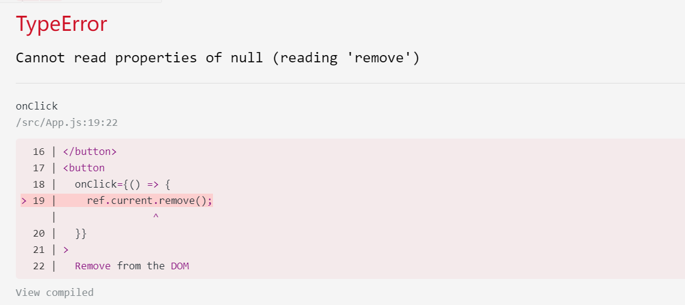
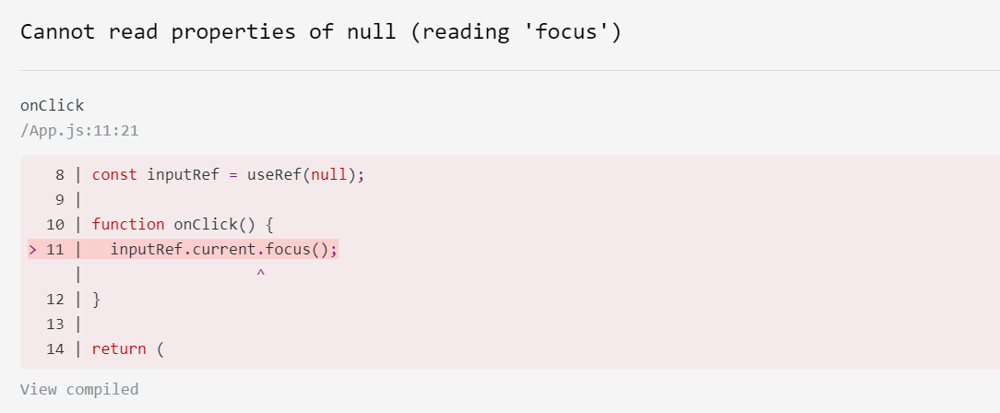

In software development, an escape hatch is a mechanism that allows a developer to bypass or override certain constraints or limitations of the system. Escape hatches are typically used in situations where the developer needs to access features or functionality that is not directly exposed by the system’s API or user interface.

In react, both useEffect and useRef are marked as an escape hatch.

## Why Escape Hatches?

Why are ref and effect categorized in the escape Hatches? This is because both operate on factors that are 「out of React’s control」.

What is handled in effect is the side effects. For example:

- `document.title` is modified in useEffect. `document.title` does not belong to the state in React, React can not sense his changes, so it is classified in effect.
- making the DOM focus requires calling `element.focus()`, and the direct execution of the DOM API is not controlled by React.

Although they are factors out of React’s control, React also wants to prevent them from getting out of control as much as possible in order to ensure the robustness of the application.

To use the ref prop, you can assign it a callback function that receives the DOM element as an argument，you can then access the DOM element using the current property of the ref object.

```jsx
import React, { useRef } from "react"

function MyComponent() {
  const ref = useRef(null)
  return <div ref={ref}>Hello, World!</div>
}
```

## Out-of-Control Ref

In react, ref allows you to access the DOM elements of a component directly. This can be useful if you need to manipulate the element’s style or if you want to trigger an action based on the element’s position in the DOM.

First, look at the case where it is not out of control.

- Execute `ref.current`’s focus, blur, etc. methods
- Execute `ref.current.scrollIntoView` to scroll the element into the view
- Execute `ref.current.getBoundingClientRect` to measure the DOM size

In these cases, although we manipulate the DOM, they involve factors outside of React’s control, so they are not considered out of control.
But in the following cases.

- Execute `ref.current.remove` to remove the DOM
- Execute `ref.current.appendChild` to insert a child node

These are also DOM operations, but they are within React’s control, so performing these operations via ref is out of control.

Here is an example of an out of control situation caused by using Ref to manipulate the DOM.

```jsx
export default function Counter() {
  const [show, setShow] = useState(true)
  const ref = useRef(null)

  return (
    <div>
      <button
        onClick={() => {
          setShow(!show)
        }}
      >
        Toggle with setState
      </button>
      <button
        onClick={() => {
          ref.current.remove()
        }}
      >
        Remove from the DOM
      </button>
      {show && <p ref={ref}>Hello world</p>}
    </div>
  )
}
```



